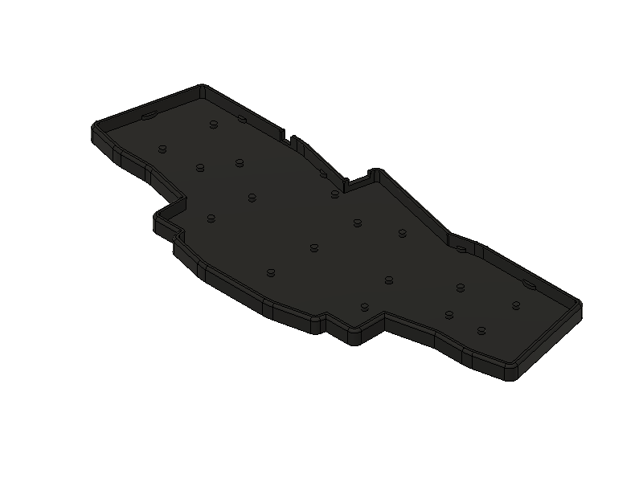
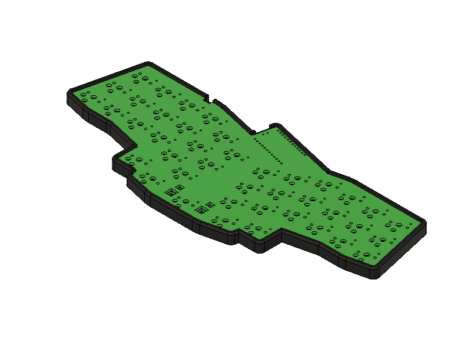

# Tray Case for Rev41lp

This is a tray case for rev41lp, since the PCB has no mounting holes it's supposed to stay in place by friction.

* Download STL to print: [41_1350_case.stl](41_1350_case.stl)
* Download Fusion360 file to remix: [41_1350_case.f3d](41_1350_case.f3d)

## Previews

